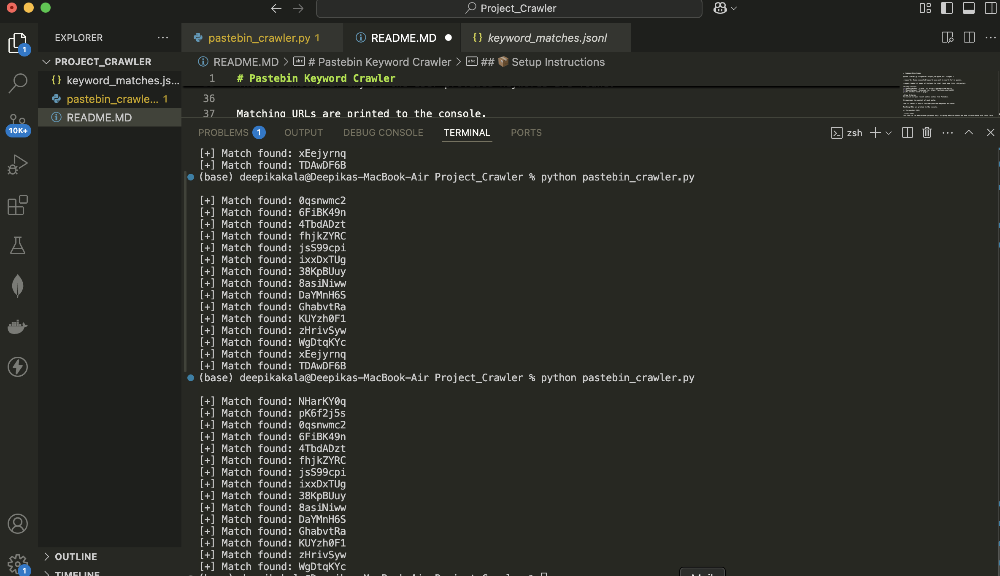

# Pastebin Keyword Crawler

A Python script to crawl recent public pastes on Pastebin.com and search for specified keywords like `crypto`, `telegram`, `btc`, etc.

---

## 📦 Setup Instructions

1. Clone the repository:
   ```bash
   git clone https://github.com/your-username/pastebin-keyword-crawler.git
   cd pastebin-keyword-crawler

2. Install dependencies:
pip install -r requirements.txt

🚀 Command-Line Usage

python crawler.py --keywords "crypto,telegram,btc" --pages 5

--keywords: Comma-separated keywords you want to search for in pastes.

--pages: Number of pages of Pastebin to crawl (each page lists ~50 pastes).

📤 Sample Output
[+] Found keyword 'crypto' in: https://pastebin.com/abc123
[+] Found keyword 'telegram' in: https://pastebin.com/xyz456
[+] No matches found on page 3

📄 How It Works
The script scrapes recent public pastes from Pastebin.

It downloads the content of each paste.

Then it checks if any of the user-provided keywords are found.

Matching URLs are printed to the console.

🖼️ Screenshot (POC)

## 🖼️ Screenshot (POC)




🧑‍💻 Author
Deepika Kala
